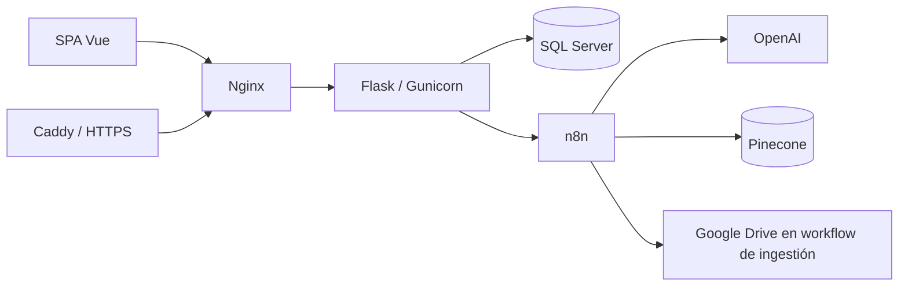

# Spec-000 — TutorIA MVP · v0.1.0

> Especificación retrospectiva del estado implementado al cierre de la primera versión.
> Baseline funcional y técnico para la evolución mediante Spec Driven Development.

## 1. Identificación y propósito

| Campo | Valor |
|---|---|
| Producto | TutorIA |
| Versión de la aplicación descrita | **v0.1.0** |
| Especificación | Spec-000 |
| Fecha de cierre documental | 2026-09-29 |
| Tipo | Especificación de versión implementada (*as-built*) |
| Alcance | MVP web académico multiinstitucional |
| Fuente del baseline | Código, esquema SQL, configuración y workflows del repositorio |

Este documento establece qué contiene TutorIA en **v0.1.0**, cómo funciona y cuáles son sus límites. Describe la implementación existente; no es un backlog, un plan de trabajo ni una propuesta de funcionalidades futuras. Las limitaciones forman parte del estado de esta versión, no de compromisos de entrega.

El cierre identifica el primer incremento consolidado de la aplicación. No equivale a una certificación de seguridad, disponibilidad o preparación integral para producción.

### 1.1 Método de desarrollo y transición a SDD [Spec Driven Development]

Hasta v0.1.0, TutorIA se desarrolló mediante **Scrum y entregas incrementales**, no mediante Spec Driven Development. Las funcionalidades y decisiones se construyeron y ajustaron durante esos incrementos. Esta especificación se redacta después de la implementación para registrar su resultado, sin atribuirle retrospectivamente un proceso de especificación previa que no se utilizó.

**Desde este punto, el desarrollo adopta SDD: Spec Driven Development —desarrollo dirigido por especificaciones—.** Spec-000 constituye el punto de partida. Los cambios posteriores se describirán en especificaciones que definan alcance, comportamiento, contratos y condiciones de verificación antes de implementarlos. Scrum puede seguir organizando las iteraciones; SDD aporta la referencia funcional y técnica de los cambios.

## 2. Producto y actores

TutorIA es una aplicación web de tutoría académica con separación de datos por institución. Relaciona instituciones, cuentas, cursos y matrículas con una experiencia de aprendizaje asistida por IA. El tutor utiliza contexto de curso, configuración pedagógica y, cuando las integraciones externas lo proporcionan, material recuperado mediante RAG.

| Rol | Función en v0.1.0 |
|---|---|
| `super_admin` | Administrar instituciones, planes, suscripciones y coordinadores |
| `coordinador` | Gestionar cursos, estudiantes, matrículas, tutor, conocimiento y analíticas de su institución |
| `estudiante` | Acceder a cursos matriculados, conversar, practicar, solicitar recursos y consultar agenda |

Cada usuario institucional pertenece a una institución; el superadministrador puede no estar asociado a ninguna. Los cursos pertenecen a una institución y las matrículas vinculan directamente estudiantes y cursos. No existe una estructura intermedia de grupos de materia.

## 3. Alcance funcional implementado

### 3.1 Identidad, sesión y perfil

- Inicio de sesión con email y contraseña, verificando hashes compatibles con Werkzeug.
- JWT con vencimiento de 24 horas, enviado como bearer token por la SPA.
- Sesión del cliente en `localStorage`, guards por rol y limpieza de sesión ante errores de autenticación.
- Revalidación de usuario activo, institución activa y roles actuales en los decoradores de autorización del backend.
- Perfil propio: consulta y actualización de datos personales; cambio de contraseña verificando la actual.
- Validación estructural de contraseñas en altas y cambios desde la API.
- Emails normalizados y únicos globalmente.
- Registro público deshabilitado por defecto y habilitable mediante `ALLOW_PUBLIC_REGISTRATION`.

El seed utiliza `password` para sus cuentas iniciales de demostración. Es una excepción del bootstrap SQL, no un cambio de la política de contraseñas de la API. El atributo `email_verified` existe, pero no hay un circuito de verificación mediante correo.

### 3.2 Administración general

- Alta, consulta, edición, activación/desactivación y eliminación de instituciones.
- Administración de planes: nombre, capacidad de cuentas, almacenamiento declarado y estado.
- Administración de una suscripción por institución: plan, vigencia y cuota mensual de tokens.
- Administración de coordinadores asociados a una institución.
- Perfil del administrador dentro de su panel.

Los límites del plan permiten `NULL` para representar capacidad ilimitada. El campo de almacenamiento no equivale a una aplicación integral de esa capacidad en todas las integraciones.

### 3.3 Coordinación académica

- Catálogo institucional de cursos: creación, edición, consulta, activación/desactivación y eliminación permanente.
- Código de curso controlado dentro de la institución; el esquema inicial refuerza su unicidad cuando no es nulo.
- Importación de cursos y estudiantes desde Excel.
- Gestión de cuentas de estudiantes y matrículas directas en cursos.
- Búsqueda de estudiantes por datos personales y email.
- Consulta y edición del nombre y dominio de la institución.
- Configuración del tutor por curso: prompt, temperatura, modos permitidos y extensión de conocimiento.
- Carga de PDF, consulta de trabajos de ingestión, reintentos y eliminación de conocimiento.
- Analítica institucional con filtros y desgloses de actividad y consumo.

Las altas e importaciones utilizan comprobaciones de capacidad institucional. No constituyen una reserva transaccional de capacidad ante altas concurrentes.

### 3.4 Experiencia del estudiante

- Listado de cursos según matrícula activa.
- Creación, listado, renombrado y archivado de conversaciones propias.
- Historial de mensajes vinculado a usuario y curso.
- Tres modos del tutor: **consulta**, **práctica** y **recursos**.
- Adjuntos de imagen: PNG, JPEG, WEBP o GIF, hasta 4 MiB, con validación de entrada en el backend.
- Dictado de voz como mejora progresiva según soporte del navegador.
- Recursos Mermaid con visualización ampliada.
- Agenda de lectura para cursos matriculados, filtrable por estado y curso.
- Perfil propio y estados de carga, error e indisponibilidad.

Archivar una conversación cambia su estado activo; no elimina físicamente sus mensajes.

### 3.5 Consumo y analíticas

- Comprobación de vigencia de la suscripción antes de las solicitudes IA.
- Cuota mensual por institución, calculada desde el inicio del mes UTC.
- Comprobación conservadora de tokens disponibles antes de invocar al proveedor.
- Registro de tokens de entrada/salida, operación, curso, usuario y costo estimado.
- Precios versionados por proveedor/modelo y snapshot de tarifa en cada consumo.
- Uso de tokens informados por n8n cuando existen; estimación con `tiktoken` como alternativa.
- Analíticas de consumo, actividad, participación, continuidad y cobertura de respuestas con fuentes, según los registros disponibles.

El costo es una estimación en USD, no una factura del proveedor. El control previo de cuota no reserva saldo atómicamente: varias solicitudes concurrentes pueden comprobar el mismo saldo antes de registrar su consumo.

## 4. Interfaz y navegación

Los roles comparten componentes visuales, manteniendo sus opciones y permisos:

- [RoleSidebar.vue](../../frontend/src/components/RoleSidebar.vue): navegación, colapso, cierre y logout.
- [PanelTitle.vue](../../frontend/src/components/PanelTitle.vue): encabezado bicolor «Panel» y nombre del rol.
- [ProfileSection.vue](../../frontend/src/components/ProfileSection.vue): edición del perfil.
- [MermaidMessage.vue](../../frontend/src/components/MermaidMessage.vue): texto y diagramas del tutor.

En escritorio, el sidebar es permanente y contraíble a iconos. En pantallas pequeñas es temporal, con hamburguesa, cierre y fondo desenfocado. El logout se ubica en el sidebar compartido. Los layouts se adaptan a escritorio, tablet y móvil.

Mermaid se importa bajo demanda. Su fuente se entrega al renderizador sin reparación ni validación sintáctica previa personalizada. El SVG se sanitiza con DOMPurify y se muestra con fondo independiente del chat. No se declara certificación formal de accesibilidad ni una matriz exhaustiva de pruebas visuales entre navegadores.

## 5. Arquitectura

| Capa | Tecnologías |
|---|---|
| Cliente | Vue 3, JavaScript, Pinia, Vue Router, Axios, Vuetify, Tailwind y FullCalendar |
| Recursos visuales | Mermaid y DOMPurify |
| Build y lint frontend | Vite y ESLint |
| API | Python, Flask, Flask-JWT-Extended, Flask-SQLAlchemy y Flask-Limiter |
| Persistencia | SQL Server, SQLAlchemy, pyodbc y ODBC Driver 17 en la imagen backend |
| IA y automatización | Webhooks n8n, OpenAI, Pinecone y herramientas subordinadas en n8n |
| Empaquetado | Docker, Gunicorn, Nginx y Docker Compose |
| HTTPS | Caddy en el overlay de producción |

El backend separa modelos, blueprints y servicios de cuotas, precios, tokens, validación e ingestión. La SPA separa vistas por rol, componentes, servicios API, estado y routing. La estructura es modular y conserva reglas en rutas y servicios; no se declara una implementación completa de Clean Architecture.

### 5.1 Superficie HTTP

| Base de rutas | Responsabilidad |
|---|---|
| `/api/auth` | Login, registro condicionado, identidad y perfil |
| `/api/admin` | Instituciones, planes, suscripciones y coordinadores |
| `/api/coordinador` | Cursos, estudiantes, matrículas, agente, conocimiento y analíticas |
| `/api/estudiante` | Cursos, sesiones, mensajes, modos y agenda |

La API utiliza JSON y multipart para archivos. Los resultados conservan el formato de cada endpoint; no hay un envelope uniforme ni una especificación OpenAPI completa y versionada. Las rutas no están prefijadas con una versión de API.

## 6. Flujos e integraciones

### 6.1 Autenticación y acceso

El cliente envía credenciales a `/api/auth/login`. El backend verifica contraseña, cuenta activa, institución activa cuando corresponde y roles; devuelve JWT y datos del usuario. La SPA selecciona el panel y añade el token a las solicitudes.

El coordinador opera con filtros de institución. El estudiante accede a conversaciones propias y cursos autorizados. El superadministrador utiliza rutas administrativas, no actúa implícitamente como coordinador institucional.

### 6.2 Tutor IA

El backend valida curso, sesión, modo permitido y cuota. Envía a n8n institución, curso, namespace, configuración del tutor, estudiante, conversación, mensaje, imagen opcional y límite de respuesta.

Normaliza la respuesta para persistir mensajes, citas cuando existen y consumo. El contexto pedagógico, recuperación vectorial, visión y generación del recurso se ejecutan en n8n y sus herramientas. El historial SQL y la memoria del agente son distintos: Flask no envía todo el historial en cada solicitud.

Consulta y práctica pueden persistir un mensaje de indisponibilidad y responder con `service_unavailable` ante fallos externos. Recursos tiene un tratamiento distinto y puede responder `502` sin ese fallback. La disponibilidad del proveedor no está garantizada por la aplicación.

### 6.3 Material y RAG

- Hasta 10 archivos por carga y 20 MiB por PDF; comprobación de contenido no vacío y cabecera PDF.
- Documentos temporales en disco por identificador de trabajo, no exclusivamente en memoria del worker.
- Trabajo SQL con estados `queued`, `processing`, `completed`, `failed` o `unknown`.
- Invocación multipart a n8n con institución, curso, coordinador y trabajo.
- Métricas aceptadas tanto en primer nivel como dentro de `data`.
- Reintentos mientras los archivos siguen disponibles; limpieza local tras completar el trabajo.
- Eliminación de documento o limpieza del namespace solicitada a n8n, seguida de actualización del historial local.

El namespace es `inst_{institucion_id}_curso_{curso_id}`. El Compose actual no monta un volumen persistente para los PDF temporales: reemplazar el contenedor puede impedir reintentos pendientes.

### 6.4 Artefactos externos y reproducibilidad

El repositorio contiene:

- [students-agent-chatbot.json](../../automation/workflows/students-agent-chatbot.json): normalización de entrada, configuración, modos y herramientas del tutor.
- [upload-to-pinecone.json](../../automation/workflows/upload-to-pinecone.json): PDF, embeddings, indexación e integración con Google Drive.
- [knowledge-index-admin.json](../../automation/workflows/knowledge-index-admin.json): eliminación de documentos o limpieza del conocimiento.

El workflow de chat normaliza los campos actuales de institución, curso, mensaje y conversación. Las herramientas subordinadas de RAG y Mermaid están referenciadas por identificadores externos; su contenido no está incluido íntegramente en esos tres artefactos. No se puede certificar la recuperación extremo a extremo solo con estos exports.

El export de ingestión conserva diferencias relevantes: usa `sourceFile` para identificar el archivo, mientras la eliminación por documento utiliza `archivo`; el enriquecimiento toma datos del primer elemento del lote. La atribución y eliminación de múltiples documentos no se consideran certificadas en este baseline. Los workflows desplegados fuera del repositorio pueden diferir de los exports.

### 6.5 Eliminaciones

Cursos e instituciones se eliminan físicamente. El backend limpia dependencias explícitas donde SQL Server o bases anteriores conservan claves sin cascada. En particular, elimina logs de actividades antes de borrar un curso.

El consumo histórico puede conservarse con `curso_id = NULL` al borrar un curso. El borrado institucional retira sus dependencias. Borrar el registro SQL de curso no certifica por sí mismo la limpieza de vectores o respaldos en Drive: las operaciones de conocimiento tienen un flujo propio.

## 7. Modelo de datos e instalación

El esquema inicial contiene 16 tablas:

| Área | Tablas |
|---|---|
| Identidad | `users`, `roles`, `user_roles` |
| Institución y licencia | `instituciones`, `planes`, `suscripciones` |
| Academia | `cursos`, `estudiante_cursos`, `configuracion_ia` |
| Conversación | `sesiones_chat`, `mensajes_chat` |
| Agenda | `actividades_agenda`, `log_notificaciones` |
| Consumo | `precios_modelo_ia`, `consumo_tokens` |
| Ingestión | `rag_ingestion_jobs` |

Instituciones, usuarios y entidades relacionadas utilizan UUID nativos; cursos, roles, planes y tarifas utilizan enteros. El ORM representa varios UUID como strings; `db.create_all()` no es el mecanismo de instalación. Las fechas del esquema inicial se almacenan en UTC.

### 7.1 Scripts

1. [001-initial-schema.sql](../../database/001-initial-schema.sql): crea la base si el operador tiene permisos, requiere base vacía y crea tablas, restricciones e índices transaccionalmente.
2. [001-seed-data.sql](../../database/001-seed-data.sql): carga roles, administración, tarifa y ejemplos opcionales mediante valores al comienzo del archivo.

Los scripts seleccionan `tutoria-webapp`. En hosting con nombre impuesto, el destino debe corresponder a la base autorizada y a `DATABASE_URL`; ese nombre literal no describe necesariamente una instalación existente.

`@CargarEjemplos = 0` limita la carga a roles, administración y tarifa. La repetición evita duplicados y conserva contraseñas y suscripciones existentes. La actividad queda anclada a la fecha inicial de la institución. Las tarifas son valores configurados, no precios consultados automáticamente al proveedor.

Estos scripts son de instalación, no migraciones para bases con datos.

## 8. Configuración y operación

| Configuración | Uso |
|---|---|
| `DATABASE_URL` | Única conexión SQLAlchemy/SQL Server, compartida por desarrollo y producción |
| `JWT_SECRET_KEY` | Firma JWT, requerida al iniciar |
| `FLASK_ENV` | Perfil de configuración |
| `FRONTEND_URL` | Orígenes CORS |
| `N8N_CHAT_WEBHOOK_URL` | Tutor |
| `N8N_EMBEDDINGS_WEBHOOK_URL` | Procesamiento de materiales |
| `N8N_KNOWLEDGE_ADMIN_WEBHOOK_URL` | Administración del conocimiento |
| `RAG_UPLOAD_STORAGE_PATH` | Directorio temporal de PDF |
| `ALLOW_PUBLIC_REGISTRATION` | Registro público opcional |
| `RATELIMIT_STORAGE_URI` | Rate limiting; memoria por defecto |
| `VITE_API_URL` | Base API de la SPA; `/api` en Docker |
| `DOMAIN`, `APP_PORT` | Dominio HTTPS y publicación del frontend |

Las credenciales de proveedores se configuran en sus servicios. SQL no crea el usuario de conexión ni configura secretos de la aplicación.

[docker-compose.yml](../../docker-compose.yml) define backend y frontend. SQL Server y n8n son externos, no provisionados por Compose. [docker-compose.production.yml](../../docker-compose.production.yml) añade Caddy, HTTP/HTTPS y volúmenes de certificados.

Caddy entrega tráfico a Nginx; Nginx sirve la SPA y reenvía `/api` a Gunicorn. La API dispone de `/healthz` para disponibilidad del proceso y `/readyz` para SQL Server; el proxy los expone como `/api/healthz` y `/api/readyz`.

El backend emite logs JSON y `X-Request-ID`. La guía operativa está en [README.md](../../README.md). Credenciales públicas del seed y secretos de ejemplo no son adecuados para exposición a usuarios reales.

## 9. Límites de v0.1.0

No forman parte de esta versión:

- Gestión completa de actividades desde UI/API y envío efectivo de notificaciones.
- Recuperación de contraseña por correo, verificación real de email, MFA, SSO y registro de revocación individual de JWT.
- Pagos, facturación y renovación automática de suscripciones.
- Aplicación móvil nativa, edición colaborativa y clases en tiempo real.
- API pública versionada y catálogo OpenAPI completo.
- Migraciones automáticas, pipeline CI/CD y suite propia de regresión automatizada mantenida en el repositorio.
- Alta disponibilidad, despliegue sin interrupción y backup/restore automatizado y certificado.
- Evaluación sistemática de factualidad, seguridad pedagógica y calidad del tutor.

Límites técnicos conocidos:

- Rate limiting en memoria por defecto, sin contadores compartidos entre réplicas.
- Cuotas y capacidad sin reserva atómica bajo concurrencia.
- Bearer token accesible desde JavaScript en el navegador.
- Sin protocolo de firma y protección contra replay implementado en las llamadas backend a webhooks.
- Dependencia de credenciales, herramientas y estados externos que el repositorio no reproduce completamente.
- Ingestión síncrona y almacenamiento temporal sin persistencia garantizada al reemplazar contenedores.
- Sin garantía integral de retención, borrado o conciliación entre SQL, Pinecone y Google Drive.

Son límites del MVP, no nuevas funcionalidades ni un plan de ejecución.

## 10. Referencias y continuidad

- [Aplicación backend](../../backend/app.py)
- [Configuración](../../backend/config.py)
- [Identidad y autorización](../../backend/routes/auth_multi_tenant.py)
- [Administración](../../backend/routes/instituciones.py)
- [Coordinación](../../backend/routes/coordinador.py)
- [Estudiante](../../backend/routes/estudiante.py)
- [Ingestión RAG](../../backend/services/rag_ingestion.py)
- [Cuotas](../../backend/services/subscription_quota.py)
- [Dependencias frontend](../../frontend/package.json)
- [Instalación y operación](../../README.md)

Spec-000 registra el estado consolidado de **v0.1.0**. Las especificaciones posteriores parten de este baseline y distinguen comportamiento existente y nuevo. No se reconstruye la historia incremental como historias de usuario, planes o tareas escritos a posteriori.